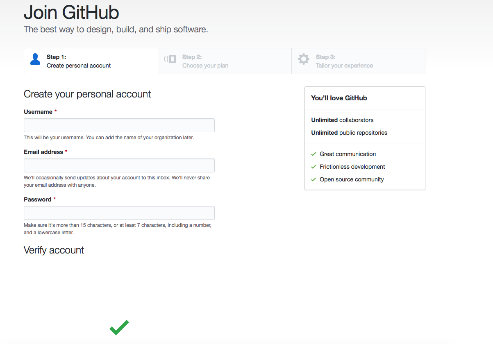

# GitHub Tutorial

_by Unaza Noor_

---
## Git vs. GitHub
#### Git
* Git is version control, meaning it keeps what we call "snapshots" of code
   * it keeps copies of your old code
* Git does not rquire github
* git runs in the commandline
* In git, you have a **directory** of files  

_"git is like a family photographer, it shows change over time"_ - Mr. Mueller  

Think of this as when you are 
Intitializing git is like hiring a photographer, you only do it once in the beginning, we call an initialized git a repository  
Adding files to the staging area is like putting people in ther frame of the photo, it gets them ready, but doesnt actually take the picture yet.  
Commiting your file is the part where you take the snapshot, or the picture in this scenario  
**NEVER EVER** type Git init into your workspace*

#### Github
* _requires_ Git
* allows you to easily collaborate on projects
* stores code in the cloud
* Visually tracks changes
* also runs in the command line

---
## Initial Setup
### Making a github account

_if you already have a github account, skip this step_
1. To create a github account, go to the website and click sign up, or click [**_here_**](https://github.com/join?source=header-home)  
you should see this:  

2. follow the steps
3. Congrats you have an account!
### Setting up an SSH key


---
## Repository Setup


---
## Workflow & Commands


---
## Rolling Back Changes


---
## Error Handling
*If you accidentally initialized git into your workspace:
```
username:~/workspace $ git init
```
, youll be able to tell because now it looks like this:
```bash
username:~/workspace (master) $ 
```
notice that you are on the master branch, you shouldn't be,
but, dont worry, All you have to do is type this command :  

```bash 
rm-rf .git
```
and now you're back to normal.